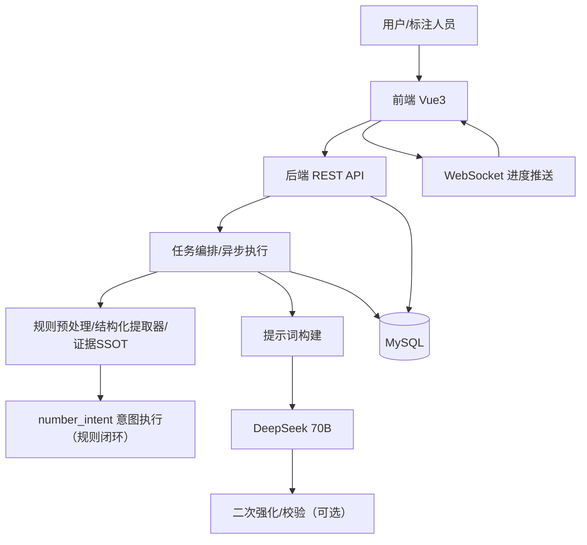
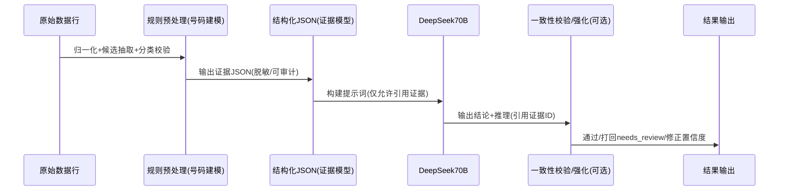

# 架构设计

## 总体架构

## 技术栈
- **后端:** Java 8 / Spring Boot 2.7.x / JPA / OkHttp / WebSocket
- **前端:** Vue 3 / Vite / TS / Element Plus / Pinia
- **数据:** MySQL 8
- **大模型:** DeepSeek 70B（OpenAI 兼容接口）

## 核心流程（目标形态：规则建模 → LLM 分析 → 校验）

## 重大架构决策

| adr_id | title | date | status | affected_modules | details |
|--------|-------|------|--------|------------------|---------|
| ADR-001 | 号码类任务以规则证据为SSOT，LLM只做分析与解释 | 2026-01-19 | ✅已采纳 | backend | ../history/2026-01/202601192135_num_extraction_99/how.md |
| ADR-003 | 号码类标签引入 number_intent（显式意图驱动，规则优先） | 2026-01-20 | ✅已采纳 | backend/frontend | ../history/2026-01/202601200006_phone_bank_number_intent_99/how.md |
